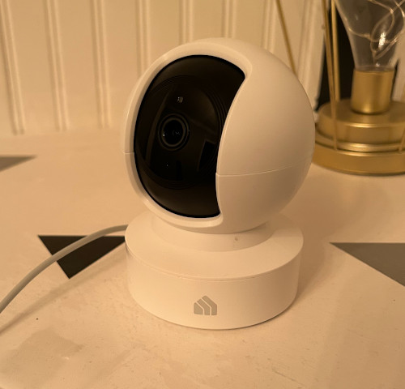
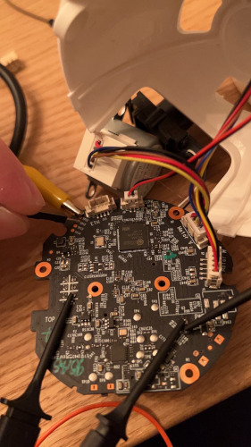

# Reverse Engineering the EC70 IP Camera

I decided I wanted to start looking into IP cameras and this one was
relatively cheap and had good reviews so I figured it was a good place
to start.

After opening the camera up and inspecting the board I found some copper
test points that vaguely look like they might be uart and next to it
some port labeled ETH so maybe ethernet? I tried connecting an alligator
clip to flash chip in order to dump flash but I continuously kept
getting "chip is blank" so either I don't know how to hook up the chip
or there is something stopping me from dumping flash.  So I guess it was
back to seeing if those test pins were uart or not.  I did some
connectivity tests and determined one to be ground (TP13) which was a good
start.  I connected my uart cable to a ground elsewhere on the board, powered on the board and
then held the RX wire onto each of the other test points until TP11 started
printing text.  So I was able to read the uart but I cannot type and
hold two wires on the RX and TX so I got and clip onto the uart TX and
then booted the camera up.  Then whenever I wanted to send a command I
manually held the TX wire to the RX test point (TP12).

I also accidentally pulled the power off of the board so I had to
manually hook them up to power the device.
